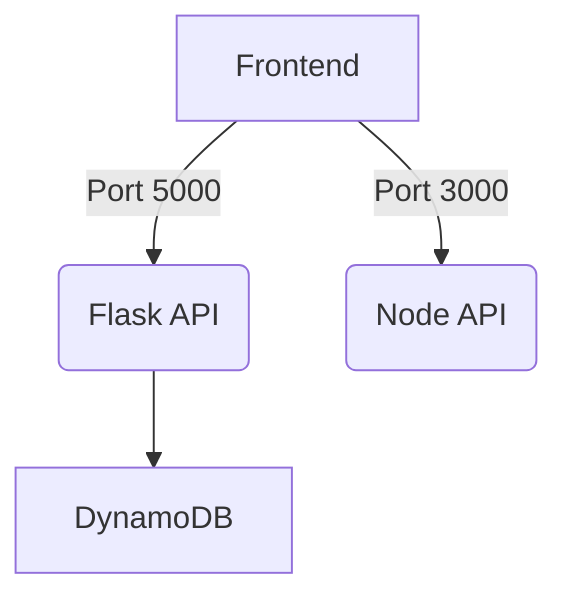

# CSCI4650 - Intro to Cloud Computing Final Project
*Created by: Kristian Patdu, Luke Flynn, Taisuke Kaneko, Tait Vasa*

A cloud-based appointment scheduling system that allows users to:
- Registering new appointments
- Accessing existing appointments through a unique UUID
- Rescheduling existing appointments

## Architecture

## AWS Services Used
- Amazon EC2 Instance for hosting our application
- AWS IAM roles for DynamoDB access (No need for a key)
- DynamoDB for storing our appointment data

## Frontend Applications
- HTML for basic page structuring
- CSS for styling HTML code
- JavaScript for API calls
## Backend Applications
- Flask communicates with the DynamoDB through boto3
- Node.js help provide endpoints for communication and generating UUIDs

## Additional Tools Used
- boto3 - Official AWS SDK for Python for interaction with AWS Services
- @aws-sdk/client-dynamodb - Module in Node.js for DynamoDB interaction
- @aws-sdk/lib-dynamodb - Wrapper for the client-dynamodb module
- pm2 - Process Manager to keep flask and nodejs running
- uuid@8.3.2 - Node.js library for generating UUIDs
